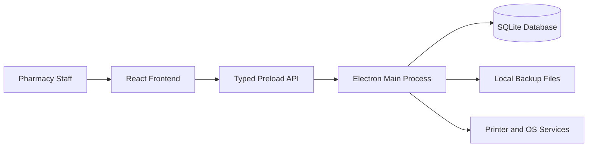
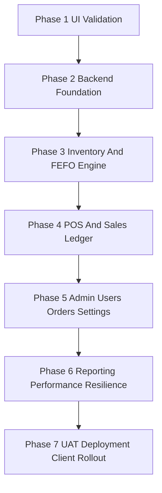
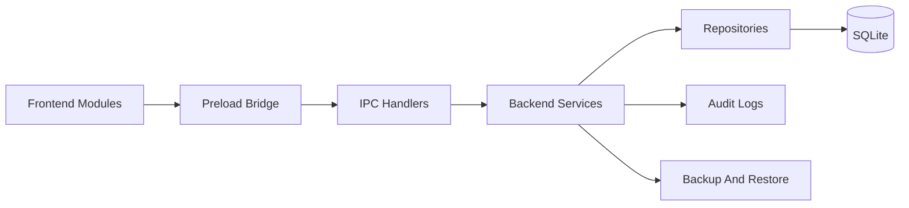

# BotikaPlus Pharmacy POS - Offline SDLC Master Plan

## 1. Project Context And Objectives
- **Domain:** Pharmacy / Drugstore
- **Product Type:** Point of Sale (POS), Inventory, Orders, Admin, Reporting, and Receipt Management
- **Brand:** BotikaPlus
- **Architecture:** Pure offline desktop application using Electron, React, and local SQLite
- **Primary Deployment Model:** Single local workstation per client branch, with future expansion considered only if the business later requires multi-terminal support
- **Main Goal:** Deliver a fast, reliable, auditable, and client-ready pharmacy desktop system that does not depend on internet connectivity or cloud services during daily operations

### Core Product Objectives
- Ensure the POS remains fully operational even without internet access
- Enforce FEFO inventory handling for pharmacy-safe stock movement
- Keep the system highly responsive for large catalogs and long transaction histories
- Centralize business rules in the backend so the frontend stays clean and maintainable
- Make deployment, backup, restore, and long-term support simple for a real client environment

---

## 2. System Architecture



### Architecture Summary
- The **frontend** is responsible for views, user interaction, validation hints, and presentation states
- The **frontend mappers** (`lib/mappers.ts`) decouple raw SQLite rows from React UI state, making the views immune to future database schema adjustments.
- The **preload layer** exposes a narrow, typed API surface from Electron to React.
- The **preload layer** is deliberately generated as native, un-bundled CommonJS (`.cjs`) via `node:fs` to strictly comply with Electron's security sandbox without ESModule parsing conflicts, ensuring zero-downtime startup.
- The **backend** owns business rules, transactions, FEFO enforcement, RBAC enforcement, and persistence
- **SQLite** is the single system database and the local source of truth
- All transient backend failures securely dispatch into a global frontend `app-error` hook, piping logs seamlessly into the user notifications bell instead of crashing views.

### Layer Responsibilities

#### Frontend Layer
- Login, dashboard, inventory, POS, orders, admin, profile, and receipt editor screens
- Form UX, loading states, success states, empty states, and error presentation
- Client-side input assistance only; no critical rule enforcement belongs here

#### Backend Layer
- SQLite connection management
- Schema migrations and seed/import workflow
- FEFO stock logic, atomic checkout, receipt payload preparation, audit logging, and role checks
- Local backup, restore, export, and integrity-oriented maintenance tasks

---

## 3. Engineering Principles
- **Offline First:** No core pharmacy workflow should depend on internet connectivity
- **Backend-Owned Rules:** FEFO, stock deductions, RBAC, and pricing rules must be enforced in Electron backend services
- **Atomic Operations:** Checkout, receiving, stock adjustments, and void flows must use SQL transactions
- **Auditability:** Every sensitive action should leave a traceable record
- **Scalability:** Search, filtering, pagination, and reporting must be implemented with SQL-level efficiency
- **Safety Over Convenience:** Hard deletes should be rare; disable or archive records where appropriate
- **Client Readiness:** Documentation, backups, recovery steps, and test coverage must be good enough for a real client rollout

---

## 4. Current State Assessment

### Phase 1 Status: Completed UI And Workflow Validation
- Authentication flow exists with role-based routing
- Inventory, POS, Orders, Admin, Dashboard, Profile, Sales, and Receipt Editor screens are already prototyped
- `mockData.ts` already models pharmacy-friendly FEFO batch concepts and packaging hierarchies
- Several screens still rely on local mock state, so the next major milestone is replacing mock sources with backend-driven SQLite data

### Current Frontend Modules Already In Place
- `frontend/components/Login.tsx`
- `frontend/components/Dashboard.tsx`
- `frontend/components/Inventory.tsx`
- `frontend/components/POS.tsx`
- `frontend/components/Orders.tsx`
- `frontend/components/Admin.tsx`
- `frontend/components/Sales.tsx`
- `frontend/components/Profile.tsx`
- `frontend/components/ReceiptEditor.tsx`

### Current Backend Base Already In Place
- `backend/main.ts`
- `backend/preload.ts`

---

## 5. SDLC Master Plan



### PHASE 1: Requirements Gathering And UI Prototyping - Completed
*Goal: Validate pharmacy workflows, navigation, user roles, and feature coverage before backend integration.*

#### Backend Track
- Identify core entities from UI mocks and forms
- Validate required data fields for products, batches, users, orders, and receipts
- Confirm FEFO behavior and stock movement requirements from current mock logic

#### Frontend Track
- Build and refine all major screens and role-based navigation
- Validate list and card view patterns, modal flows, filtering, and pagination UX
- Confirm receipt layout editing, sales overview, and admin operations at prototype level

#### Exit Criteria
- All critical screens exist and represent the intended user flow
- Existing mock data structures are sufficient to derive a normalized SQLite schema
- Frontend UX is ready to be connected to real backend services

---

### PHASE 2: Backend Foundation And Frontend Data Access Layer - Completed
*Goal: Establish the permanent local SQLite architecture and replace direct mock usage with typed backend access.*

#### Backend Track
- Introduce a dedicated database layer under `backend/db/`
- Create a migration system for SQLite schema evolution
- Define repositories and service modules under `backend/repositories/` and `backend/services/`
- Replace generic IPC exposure with a typed preload API such as `window.api.inventory.list()`
- Define local application data path, database file path, and environment-safe startup behavior
- Provide a one-time seed or import path to move mock data into SQLite during development

#### Frontend Track
- Remove direct dependence on `mockData.ts` from operational screens where backend data is available
- Introduce frontend service wrappers or hooks for inventory, POS, users, orders, and settings APIs
- Add proper loading, error, retry, and empty states to each screen
- Preserve the current approved UI while switching the data source from local arrays to SQLite-backed calls

#### Exit Criteria
- Frontend reads and writes real local SQLite data through Electron APIs
- Main screens no longer depend on direct mock arrays for active workflows
- Backend structure is ready for feature-by-feature business rule implementation

---

### PHASE 3: Inventory And FEFO Engine
*Goal: Make inventory management operational, accurate, and auditable using real database records.*

#### Backend Track
- Implement normalized tables for products, product batches, and inventory movements
- Build product CRUD services with validation for packaging hierarchy, pricing, and active status
- Implement batch receiving flows with lot number, manufacturing date, expiry date, and received date
- Enforce FEFO queries for stock selection and near-expiry monitoring
- Introduce stock adjustment services for corrections, damaged stock, and manual recounts
- Record every stock-affecting action in an inventory movement ledger

#### Frontend Track
- Connect Inventory list and card views to real paginated SQLite queries
- Connect Add, Edit, Disable, Enable, and Delete flows to backend APIs
- Add UI for receiving new stock batches and reviewing existing batches
- Replace mock low-stock and near-expiry widgets with live backend-powered results
- Keep sorting, filtering, and pagination behavior consistent with the validated prototype

#### Exit Criteria
- Inventory reflects real SQLite records instead of mock state
- FEFO-aware batch data is fully operational
- Every stock movement is traceable and reviewable

---

### PHASE 4: POS And Sales Ledger
*Goal: Deliver a production-grade offline checkout flow with atomic stock deduction and complete sales recording.*

#### Backend Track
- Implement checkout as a single SQL transaction
- Deduct stock from the earliest-expiring sellable batch first
- Write sales transaction headers, line items, payment records, and discount metadata
- Support prescription-related metadata when required by product category or transaction rules
- Generate receipt payload data from stored configuration and transaction records
- Add void or cancellation handling with proper inventory reversal and audit logging if the business requires it

#### Frontend Track
- Connect POS catalog, filters, and pagination to SQLite-backed product queries
- Replace simulated checkout with real backend transaction submission
- Bind cart confirmation, payment flow, discount flow, and success flow to persistent records
- Display real lot number and expiry data from backend-selected FEFO batches
- Connect receipt preview and print workflows to transaction output and stored settings

#### Exit Criteria
- A completed sale updates inventory, sales ledgers, and receipt data atomically
- FEFO deduction is enforced in backend logic, not only displayed in UI
- POS remains fully usable offline during normal client operations

---

### PHASE 5: Admin, Users, Orders, And Settings
*Goal: Move administration, access control, purchase ordering, and operational settings into production-ready backend flows.*

#### Backend Track
- Implement local authentication with hashed passwords
- Create local session handling appropriate for desktop application use
- Enforce role-based access control in backend services and IPC handlers
- Build manufacturer CRUD and purchase order services
- Persist receipt settings, store profile details, and app-level settings in SQLite
- Add audit log recording for sensitive actions such as price edits, stock adjustments, user changes, and order status changes

#### Frontend Track
- Replace mock login role resolution with real local authentication
- Connect Admin accounts list, manufacturer management, and employee creation flows to backend APIs
- Connect Purchase Orders to real persistent tables and status updates
- Persist Receipt Editor and profile data using backend services
- Keep UX polished while introducing backend-driven validation and permission-aware behavior

#### Exit Criteria
- Users, orders, manufacturers, and settings are stored locally in SQLite
- Backend RBAC is active for protected operations
- Admin workflows are stable enough for real client use

---

### PHASE 6: Reporting, Performance, And Offline Resilience
*Goal: Make the system fast at scale, strong under long-term usage, and safe for client support scenarios.*

#### Backend Track
- Build reporting queries for dashboard metrics, sales summaries, product movement, and top-selling items
- Add SQLite indexes for common search, filter, and reporting patterns
- Enable FTS5 for product search by name, barcode, code, or keywords where appropriate
- Introduce backup, restore, export, and import workflows for offline support
- Add health and integrity checks for database maintenance and recovery confidence
- Optimize query shapes to avoid loading large result sets into the renderer process

#### Frontend Track
- Replace placeholder dashboard and sales metrics with backend-generated aggregates
- Add report screens and export actions for client-facing operations
- Polish empty states, long-list behavior, and large-catalog UX performance
- Surface backup and restore tools in a controlled admin-only experience if required

#### Exit Criteria
- System performs well with large product catalogs and transaction history
- Reports are powered by real aggregates
- Backup and recovery processes are documented and testable

---

### PHASE 7: Security, UAT, And Deployment
*Goal: Prepare the application for dependable client rollout and long-term support.*

#### Backend Track
- Finalize production database location strategy and data retention safeguards
- Validate startup, migration, and recovery behavior on clean client machines
- Package the desktop application for release using `electron-builder`
- Confirm backup and restore behavior under realistic support scenarios
- Fix UAT-discovered defects in data integrity, permissions, or transaction handling

#### Frontend Track
- Complete final UX polish and content cleanup
- Improve form messaging, destructive-action warnings, and permission-aware affordances
- Validate responsive behavior for the client's expected screen sizes
- Confirm receipt layout usability and transaction flow clarity during testing sessions

#### Exit Criteria
- Stable offline desktop installer ready for client deployment
- Critical workflows pass UAT
- Recovery and support procedures are documented well enough for real client operations

---

## 6. Backend And Frontend Work Breakdown



### Recommended Backend Structure
```text
backend/
  main.ts
  preload.ts
  ipc/
  services/
  repositories/
  db/
    migrations/
    seeds/
  auth/
  types/
```

### Recommended Frontend Structure
```text
frontend/
  App.tsx
  components/
  hooks/
  services/
  state/
  types/
  lib/
```

### Responsibilities Split

#### Backend Responsibilities
- Database schema and migrations
- Repository and service layers
- Business validation and rule enforcement
- FEFO logic and transaction safety
- Local authentication and RBAC
- Audit logs, backup, restore, and data integrity flows

#### Frontend Responsibilities
- Screen rendering and page-level interactions
- User input collection and UX validation hints
- Pagination controls, filters, search inputs, and dialogs
- User feedback states for loading, success, warnings, and failures
- Integration with backend through typed preload APIs only

---

## 7. Data Model Scope

### Core Tables
- `users`
- `sessions`
- `manufacturers`
- `products`
- `product_batches`
- `inventory_movements`
- `sales_transactions`
- `sales_transaction_items`
- `payments`
- `purchase_orders`
- `purchase_order_items`
- `receipt_settings`
- `app_settings`
- `audit_logs`

### Data Model Notes
- `product_batches` must support FEFO ordering through expiry date and stock quantity
- `inventory_movements` should be the audit-friendly record of all stock-affecting actions
- `products.total_stock_pieces` may exist as a cached or derived field, but should not be the only source of truth
- Sensitive changes should be attributable to a user or system action wherever possible
- Receipt configuration should be stored in SQLite so the app behaves consistently after restart or redeployment

---

## 8. Performance And Scalability Strategy

### Query Strategy
- Use SQL-level pagination for product, order, user, and transaction lists
- Avoid loading entire catalogs into React state when only one page is needed
- Prefer targeted aggregate queries for dashboard metrics instead of client-side summarization
- Consider keyset pagination later for very large transaction logs if standard offset pagination becomes a bottleneck

### SQLite Optimization Strategy
- Index common filter columns such as `name`, `code`, `category`, `sub_category`, `is_active`, `expiry_date`, and transaction dates
- Use `FTS5` for fast product search on names, codes, and barcodes
- Keep write-heavy operations transactional and short-lived
- Normalize tables enough for correctness, then denormalize only where measured performance justifies it

### Frontend Performance Strategy
- Request only the rows needed for the current page
- Keep list rendering scoped to visible UI blocks
- Reuse shared display components like `ProductCard` across screens
- Keep the renderer thin and let backend queries do the expensive data filtering work

---

## 9. Security, Quality, And Client Readiness

### Security Strategy
- Use hashed passwords for local users
- Use local session handling suitable for a desktop-only environment
- Enforce RBAC in backend services, not just hidden frontend routes
- Record important actions in `audit_logs`
- Avoid exposing unrestricted IPC access to the renderer

### Quality Strategy
- Test schema migrations and seed data repeatedly on clean environments
- Validate FEFO deduction, batch receiving, and checkout edge cases
- Test large catalogs and long transaction histories for responsiveness
- Test restart durability to confirm nothing is lost after app relaunch

### Client Readiness Strategy
- Provide backup and restore instructions suitable for non-technical client staff where possible
- Validate receipt formatting, printer interaction, and cashier flow under real usage conditions
- Perform UAT with realistic medicine catalogs, expiring stock, and busy checkout scenarios
- Keep deployment and update procedures documented for long-term support

---

## 10. AI-Assisted Implementation Guide

### Backend-Oriented Prompts
- *"Given our offline-only BotikaPlus plan, create a normalized SQLite schema for users, manufacturers, products, product_batches, inventory_movements, sales_transactions, sales_transaction_items, payments, purchase_orders, purchase_order_items, receipt_settings, app_settings, and audit_logs."*
- *"Create a migration strategy for the Electron backend so SQLite schema changes remain safe and repeatable during development and deployment."*
- *"Write the backend service and IPC handler for FEFO checkout so stock is deducted from the earliest-expiring valid batch inside a single SQL transaction."*
- *"Implement batch receiving and inventory adjustment services that always create inventory_movement records."*
- *"Design a typed preload API contract for inventory, POS, orders, admin, settings, and reporting without exposing raw unrestricted IPC primitives to the renderer."*

### Frontend-Oriented Prompts
- *"Refactor Inventory.tsx to replace direct mock data usage with typed preload API calls while preserving current UI behavior, pagination, and filters."*
- *"Connect POS.tsx to backend-driven product queries and implement real checkout submission with loading, success, and error states."*
- *"Integrate Admin.tsx and Orders.tsx with SQLite-backed APIs while keeping the current design and role-aware behavior."*
- *"Replace placeholder dashboard metrics with backend aggregate queries and maintain responsive rendering for large datasets."*
- *"Add robust empty, loading, and failure states across all major screens while keeping the current premium BotikaPlus UI language."*

### Implementation Priority Order
1. SQLite schema and migrations
2. Typed preload API and backend service structure
3. Inventory and batch engine
4. POS checkout and sales ledger
5. Admin, users, manufacturers, and purchase orders
6. Receipt settings and profile persistence
7. Reporting, backup, restore, and deployment hardening
