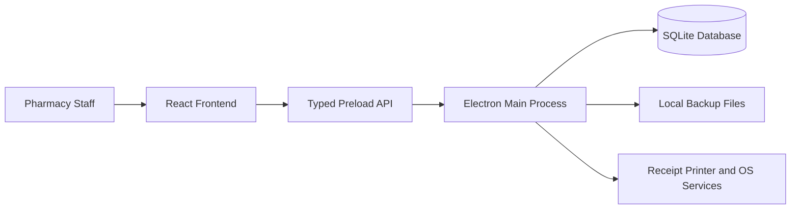

# BotikaPlus Pharmacy POS Desktop Application

BotikaPlus is a pure offline desktop Point of Sale and pharmacy operations system built for real client usage. The application is designed to run entirely on a local machine using Electron, React, and SQLite, with no cloud dependency required for day-to-day work.

## Overview
- Offline desktop workflow for pharmacy operations
- Local SQLite database as the single source of truth
- React renderer for UI, Electron main process for business logic and system access
- FEFO-aware inventory handling for batches and expiry-sensitive products
- Client-focused direction with backup, restore, auditability, and deployment planning

## Architecture



## Tech Stack
- **Desktop Framework:** Electron
- **Frontend UI:** React 18 + Vite
- **Styling:** Tailwind CSS v4
- **Database:** SQLite
- **Language:** TypeScript

## Project Structure

```text
/
├── backend/            # Electron main process, IPC bridge, services, and database logic
│   ├── main.ts         # Application bootstrap and desktop window creation
│   └── preload.ts      # Secure typed bridge between React and Electron
│
├── frontend/           # React renderer process
│   ├── App.tsx         # Main app composition and feature routing
│   └── components/     # UI screens and shared components
│
├── AI_PROJECT_PLAN.md  # Detailed offline SDLC and backend/frontend implementation roadmap
└── package.json        # Scripts and dependency manifest
```

## Current Direction
- Pure offline deployment using SQLite only
- Backend and frontend work split clearly for scalable development
- Inventory, POS, Orders, Admin, Dashboard, Profile, Sales, and Receipt flows already prototyped in the frontend
- Current documentation assumes a single local workstation deployment per client branch unless future requirements change

## Key Engineering Principles
- Keep business rules in the backend
- Keep checkout and stock changes atomic
- Use FEFO logic for sellable inventory batches
- Keep every important stock-affecting action auditable
- Prefer SQL-level pagination, filtering, and search for scalability

## Getting Started

### Prerequisites
- Node.js 18 or newer recommended
- npm

### Install Dependencies
```bash
npm install
```

### Run In Development
```bash
npm run dev
```

### Build For Production
```bash
npm run build
```

## Documentation
- `AI_PROJECT_PLAN.md` contains the main execution roadmap
- `README.md` provides the quick technical overview

## Current Priority
The next major implementation step is replacing mock frontend state with a production-grade local SQLite backend, then connecting Inventory, POS, Orders, Admin, Receipt Settings, and Reporting flows to typed Electron APIs.
